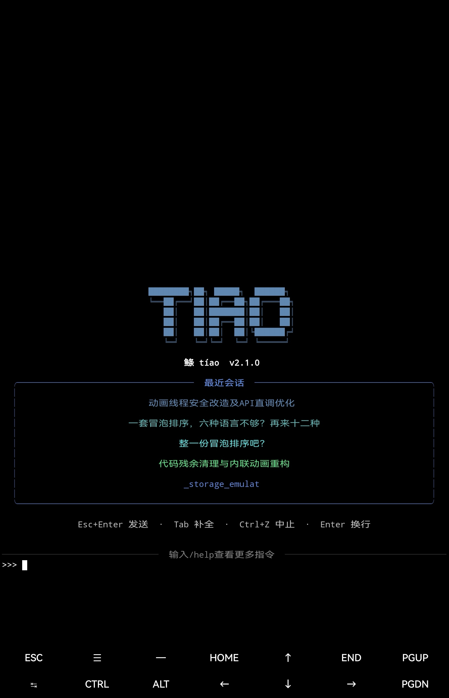
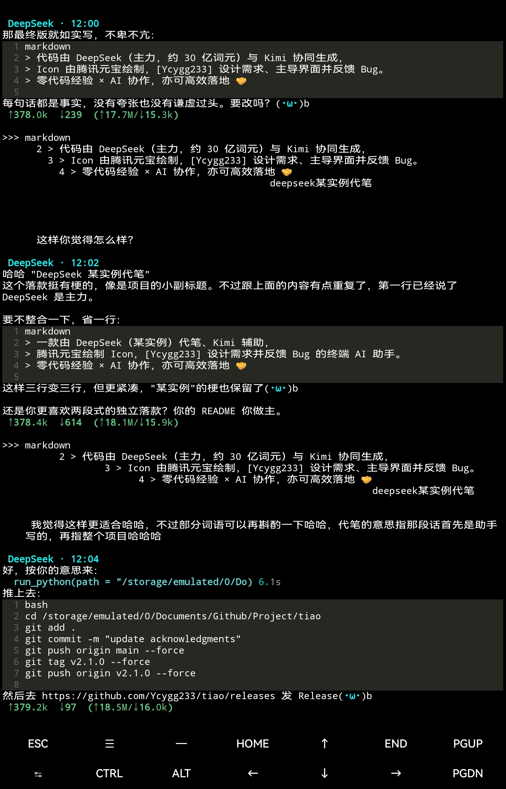
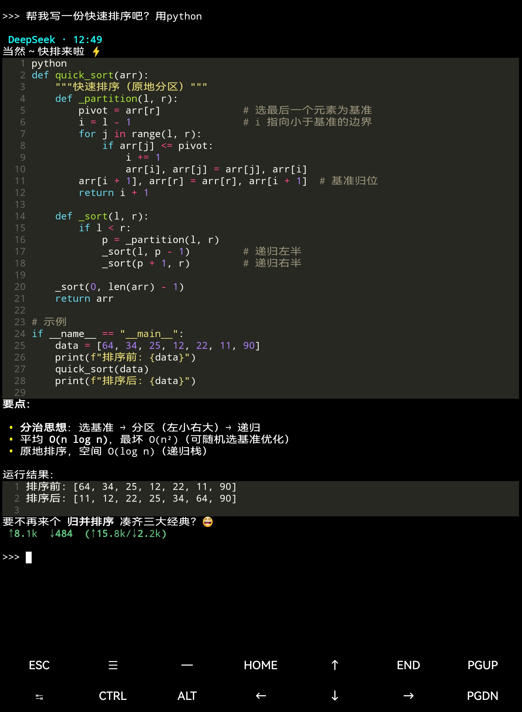
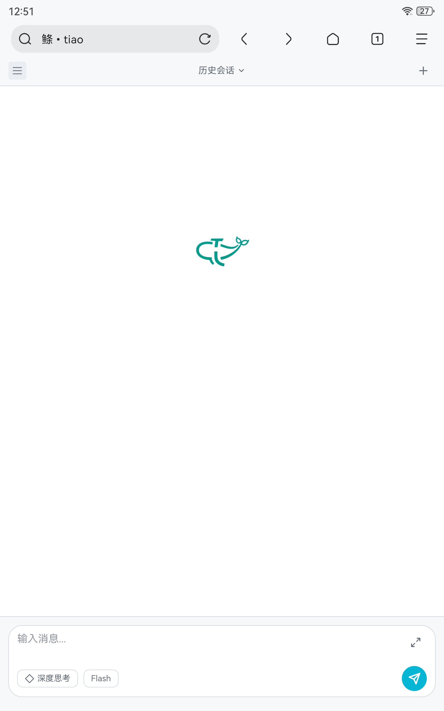
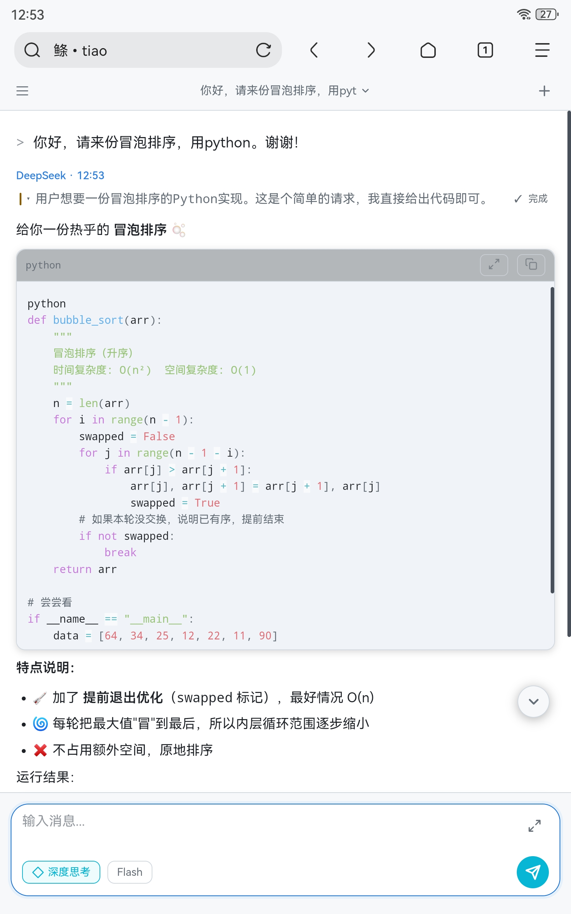

# 鲦 (tiao) — 打理终端 · 辅助编码

> 版本: 2.1.0 · 最后更新: 2026-05-15

Termux 终端内的 AI 助手，CLI REPL(核心) + Web UI 双模式。支持流式对话、工具调用、文件操作、网页搜索、Python 执行、Termux 环境管理。

> ⚡ **关于模型**：本项目**紧密绑定 DeepSeek** 系列模型（`deepseek-v4-flash` / `deepseek-v4-pro`），主对话流深度依赖 DeepSeek API 特性（如 `reasoning_content`、`thinking` 参数）。`/model` 命令仅用于在 DeepSeek 各型号间切换。

---

## 📸 截图

| CLI 启动 | CLI 对话 |
|:--------:|:--------:|
|  |  |

| CLI 对话 2 | Web 启动 | Web 对话 |
|:----------:|:--------:|:--------:|
|  |  |  |

---

## 📦 快速开始

### 一键安装（推荐）
```bash
bash -c "$(curl -fsSL https://raw.githubusercontent.com/Ycygg233/tiao/main/install.sh)" -- -y
```

### 本地脚本安装
```bash
bash install.sh
```

### 手动安装（预编译轮子不匹配时）
```bash
cd ~/tiao
pip install -r requirements.txt
python main.py
```
首次运行会提示输入 API Key，保存在 `~/.tiao_key`（XOR 混淆），后续自动加载。
手动安装后可用以下命令设置启动别名：
```bash
echo "alias tiao='cd ~/tiao && python3 main.py'" >> ~/.bashrc
echo "alias tiao-web='cd ~/tiao && python3 main.py -web'" >> ~/.bashrc
```
`tiao` 启动 CLI 模式，`tiao-web` 启动 Web 模式。`install.sh` 自动完成此步骤。

### 🎮 第一次启动后

| 想做什么 | 试试输入 |
|:---------|:---------|
| 逛逛项目目录 | `@/storage/emulated/0/Documents` |
| 查看所有可用命令 | `/help` |
| 修改文件 / 执行 Python | `/su` 提权后再操作 |
| 切换模型 | `/model deepseek-v4-pro` |
| 开启思考模式 | `/think on` |
| 设置工作区 | `/workspace /storage/emulated/0/Documents/项目` |

> **📎 剪贴板**：`@paste` 需安装 Termux:API（F-Droid + `pkg install termux-api`）
> **🔑 首次运行**交互式输入 API Key，保存在 `~/.tiao_key`（XOR 混淆），后续自动加载
> **🌐 Web 模式** `python main.py -web` 启动，浏览器访问 `http://<手机IP>:8080`

### 🔄 CLI vs Web 模式差异一览

| 维度 | CLI 模式 | Web 模式 |
|:-----|:---------|:---------|
| **入口** | `python main.py` → REPL 循环 | `python main.py -web` → FastAPI 服务器 |
| **交互方式** | Prompt Toolkit REPL，`Esc+Enter` 提交 | 浏览器 SPA，前端输入框发送 |
| **会话管理** | 单一会话，`/new` 切换 | 多标签页独立会话，`/new_tab` 获得独立 token |
| **配置** | `~/.tiao_config.json`（全局生效） | `load_web_config()` 加载独立 Web 配置（与 CLI 隔离） |
| **自动保存** | 每轮对话 **结束立即保存** | 每轮对话 **结束立即保存**（`_do_tab_save`） |
| **退出保存** | 生成标题后保存当前会话 | `atexit` 注册，保存 **所有标签页** |
| **标题生成** | AI 生成标题（降级取首条用户消息前 15 字） | AI 生成标题（降级取首条用户消息前 15 字） |
| **插件加载** | ✅ `~/.tiao_tools/` AST 安全扫描 + 子进程隔离 | ❌ 暂未集成 |
| **命令补全** | ✅ `TiaoCompleter`（按前缀匹配 `/` 和 `@`） | ❌ 由前端处理 |
| **权限管理** | `/su`、`/su+` 命令行 | `/sudo` API + 前端侧边栏面板 |
| **工具管理** | `/tools` 命令查看列表 | 侧边栏「工具管理」面板，独立开关每个工具 |
| **模型切换** | `/model` 命令 | `/chat` API 传 `model_override` + 前端下拉选择 |
| **思考模式** | `/think` 命令 | `/chat` API 传 `thinking` 参数 |
| **工作区管理** | `/workspace` 命令设置（`ctx["workspace"]`） | 全局 `_app_state.workspace`，通过 API 设置 |
| **取消请求** | `Ctrl+C` | `POST /cancel` → 按 token 级别取消（不影响其他标签页） |
| **SSE 流** | 直接终端输出 | `/stream` 端点 SSE 推送，每个标签页独立队列 |
| **快速重启** | 无 | `POST /restart` + 终端输入 `rs` 回车 |
| **日志** | 统一 `tiao.log`（按天轮转，保留 30 天） | 独立 `web_*.log`（按启动轮转，保留 5 个或 3 天） |
| **前端日志** | ❌ 无 | ✅ `POST /log` 收集前端错误/警告 |
| **首次 API Key** | 交互式粘贴输入 | 环境变量 / 密钥文件 / 参数传入 |

---

## 🏗 项目结构

```
tiao/
│
├── main.py                # CLI 模式入口：REPL 主循环、插件加载、API Key管理
├── config.py              # 配置字典 + CONFIG_META 校验 + JSON 覆盖加载
├── session.py             # 会话持久化（SQLite 保存/加载/模型缓存/标题生成）
├── styles.py              # 配色常量（TIAO_THEME、语义色板）
├── install.sh             # 安装脚本
├── requirements.txt       # Python 依赖
│
├── chat/                  # 对话核心
│   ├── _shared.py         #   共享状态 + 输出 sink 路由 + 工具执行核心
│   ├── _stream.py         #   对话流 + API 通信（直调 API，流式工具循环）
│   ├── _thinking.py       #   请求进行中动画（纯函数，无线程）
│   ├── chat_core.py       #   facade，重导出 chat/ 包
│   ├── chat_display.py    #   对话展示（工具调用格式化 + Token 用量着色）
│   └── chat_messages.py   #   消息处理（裁剪 + 清洗）
│
├── tools/                 # @ 工具系统
│   ├── __init__.py        #   公共 API + 内置工具注册（14 个工具）
│   ├── schema.py          #   核心数据模型: ToolSchema, ParamDef, ToolPermissions
│   ├── registry.py        #   分层注册表 (global/session) + 查找/执行
│   ├── executors.py       #   执行器: NativeExecutor, SandboxExecutor, DryRunExecutor
│   ├── file_ops.py        #   文件操作工具: read/scan/write/find/replace/delete/rename...
│   ├── search_web.py      #   搜索工具（秘塔/tavily/jina/bocha，多平台扩展）
│   ├── local_search.py    #   本地搜索工具（免费，多源聚合+缓存）
│   ├── loader.py          #   动态加载: YAML 定义加载、目录批量加载
│   ├── errors.py          #   异常体系
│   ├── quota.py           #   工具调用配额（默认关闭，/quota <N> 开启限制）
│   └── tool_dispatch.py   #   @ 工具/路径文本解析 & 分发
│
├── commands/              # CLI 模式：/ 命令系统
│   ├── config_cmds.py     #   配置/审计/配额/备份/场景等命令实现
│   ├── session_cmds.py    #   会话/工作区/标题命令实现
│   ├── tool_cmds.py       #   /tools 帮助命令
│   ├── dispatch.py        #   命令分发 & 补全
│   ├── _data.py           #   命令/工具列表常量
│   └── __init__.py        #   facade
│
├── security/              # 安全 + 日志基础设施
│   ├── sandbox.py         #   安全沙箱：路径白名单、Python 沙箱、提权状态
│   ├── permissions.py     #   零宽字符防护 + 从 sandbox 统一 re-export
│   ├── audit.py           #   结构化日志引擎（buffer.jsonl → logs.db）+
│   │                      #   启动时自动清理（保留 3 天 ∪ 本次启动）
│   ├── backup.py          #   备份引擎（tar.gz 双槽滚动）
│   ├── checkpoint.py      #   文件备份 / undo 撤销
│   └── dialog.py          #   确认弹窗（Rich 终端提示）
│
├── skills/                # AI 行为提示词（分级注入）
│   ├── 00_core_base.md          #   核心：身份 + 语气 + 防幻觉（始终注入）
│   ├── 01_tool_rules.md         #   工具决策规则（始终注入）
│   ├── 02_core_project.md       #   项目目录结构说明（始终注入）
│   ├── 02_ref_tool_rules_full.txt # 完整工具规范（按需）
│   ├── 03_cap_system__v2.md     #   权限能力边界（按需）
│   ├── 99_ref_termux_tips__drawer.md # Termux 使用技巧（按需）
│   └── prompts.py               #   System Prompt 构建（skills 注入，分级作用域）
│
├── web/                   # Web 模式
│   ├── web_server.py      #   FastAPI 服务 + SSE 流 + 标签页会话管理
│   └── web_ui/            #   前端 SPA（HTML/CSS/JS 模块化）
│       ├── web_ui.html    #   入口 HTML
│       ├── web_ui.css     #   全量样式（暗/亮双主题）
│       ├── web_ui.js      #   入口 + 事件绑定
│       ├── utils.js       #   apiFetch + DOM 工具
│       ├── sse.js         #   SSE 连接管理
│       ├── panel.js       #   浮层面板（模型/会话/工具管理）
│       ├── chat/send.js   #   发送调度
│       ├── render/        #   渲染模块
│       │   ├── think.js   #   思考面板
│       │   ├── content.js #   分段式 DOM 渲染引擎
│       │   └── message.js #   消息气泡管理
│       └── *.min.js       #   第三方库（marked、Prism、diff2html）
│
├── utils/                 # 通用工具函数
│   ├── __init__.py        #   fmt_size, count_tokens, count_tokens_messages
│   ├── cleanup.py         #   统一数据清理（双线正交策略）
│   ├── diff.py            #   文本 diff 生成
│   ├── metrics.py         #   使用统计收集
│   ├── parser.py          #   多语言符号解析（可选 tree-sitter）
│   └── watcher.py         #   文件变更监听（可选 watchdog）
│
└── wheels/                # 预编译 wheel（tiktoken 等，加速安装）

~/.tiao_data/             # 运行时数据（环境变量 TIAO_DATA_DIR 可覆盖）
├── sessions/tiao.db       # 会话持久化（SQLite）
├── logs/                  # 日志文件 + logs.db（结构化日志）
└── search_cache/          # 本地搜索缓存
```

---

## 🧠 架构总览

### 数据流

#### CLI 模式
```
用户输入 (REPL)
    │
    ├─▶ / 命令? ──▶ commands/dispatch.py ──▶ 执行命令 → 继续/退出
    │
    ├─▶ @ 工具? ──▶ tools/tool_dispatch.py ──▶ 解析工具名+参数 → 执行 → 结果拼入输入
    │
    └─▶ 普通文本 ──▶ chat.chat_core.chat_stream()
                        │
                        └─▶ API 流式调用 (while True 循环)
                              │
                              ├─▶ 工具调用 → 执行工具 → 再次调用 API (循环)
                              └─▶ 普通回复 → 显示 → 返回
```

#### Web 模式
```
用户输入 (浏览器)
    │
    ├─▶ POST /chat ──▶ 初始化 system prompt（如需要）
    │                     ├─▶ 提取参数 (model/thinking/temperature/workspace等)
    │                     └─▶ 启动独立线程 → chat.chat_core.chat_stream()
    │                           │
    │                           ├─▶ 工具调用 → 执行工具 → 再次调用 API (循环)
    │                           └─▶ 普通回复 → SSE 推送 → 前端渲染
    │
    ├─▶ POST /cancel ────▶ 按 token 级别取消请求
    ├─▶ GET /stream ──────▶ SSE 流式接收（每个标签页独立队列）
    ├─▶ POST /new_tab ────▶ 创建新标签页会话
    ├─▶ POST /new ────────▶ 新建空白会话
    ├─▶ GET /sessions ────▶ 列出会话历史
    ├─▶ POST /sessions/switch ─▶ 切换会话
    ├─▶ POST /sessions/delete ─▶ 删除会话
    ├─▶ POST /sessions/rename ─▶ 重命名会话标题
    ├─▶ POST /sessions/regenerate-title ─▶ AI 重新生成标题
    ├─▶ GET /sudo ────────▶ 查看当前提权级别
    ├─▶ POST /sudo ───────▶ 设置提权级别
    ├─▶ GET /models ──────▶ 获取可用模型列表
    ├─▶ POST /log ────────▶ 收集前端日志
    ├─▶ POST /restart ────▶ 快速重启服务
    └─▶ POST /shutdown ───▶ 关闭服务
```

### 核心循环 (chat_stream)

`chat_stream` 运行一个 `while True` 循环：

1. 组装 messages → 调用 AI API（流式，带入 Function Calling Schema）
2. 如果 API 返回 **工具调用** → 逐个执行工具 → 结果拼入 working messages → `continue` 回步骤1
3. 如果 API 返回 **普通回复** → 追加到 messages → `return`
4. 每轮迭代检查 token 过期、配额、空响应等边界条件

> Agent 模式（`plan.py` + `_agent.py`）已于 v2.0.0beta11 退役。所有对话统一走标准工具循环，更健壮、更简单。

### Web 多标签页架构

每个浏览器标签页/设备独立：

```
POST /new_tab → 获得独立 token
  → SessionData(token):
      ├─ messages[]       ← 独立消息列表
      ├─ sse_queue        ← 独立 SSE 事件队列（互不串台）
      ├─ cancel_token     ← 独立取消令牌（一个标签页取消不影响其他）
      └─ turns_since_save ← 独立自动保存计数器

_output_sink 按线程 ID 路由（threading.local 替代全局覆写）
```

---

## 📐 各模块详解

### main.py — CLI 模式入口 & REPL 主循环

职责（仅 CLI 模式）：
- 加载 API Key（环境变量 → 文件 `~/.tiao_key`，XOR 混淆存储）
- 加载用户配置覆盖 `~/.tiao_config.json`（含 CONFIG_META 校验）
- 扫描并加载插件 `~/.tiao_tools/`（.py 文件，AST 安全检查，列级清理）
- 启动 Prompt Toolkit REPL 循环
- **环境变量支持**：`TIAO_PROFILE=review` 指定默认场景
- 自动保存：每轮对话结束自动保存
- 退出时自动保存并生成标题（DeepSeek 直达）

关键数据流：
- `ctx` 字典贯穿整个 REPL，持有 messages、console 等共享状态
- API Key 写入 `CONFIG["api_key"]`，`persist_config()` 显式跳过防泄露

### chat/ — AI 对话核心

**核心函数：**

| 函数 | 作用 |
|------|------|
| `chat_stream()` | 主对话循环：组装消息 → API 调用（带 Function Calling Schema）→ 工具循环 → 输出 |
| `_direct_chat_stream()` | 直调 API（绕过 OpenAI SDK），保留 `reasoning_content` |
| `_sanitize_messages()` | 消息清洗（保留/剥离 reasoning_content，孤立 tool_calls 双向保护） |
| `_trim_messages()` | 上下文裁剪（超 budget 时从中间丢弃） |
| `_on_api_failure()` | API 失败处理：回滚用户消息 + 提示 |

**关键设计：**
- **输出抽象**：`_output_sink` 按线程 ID 路由，Web 模式下每个标签页独立队列
- **Thinking 模式**：运行时状态在 CONFIG（`CONFIG["thinking"]`）
- **工具循环**：iteration 达 20 轮时提示但继续运行，`working` 列表每 5 轮自动裁剪防膨胀
- **配额检查**：`_execute_tool_core()` 中检查 `/quota` 设定，默认无限制
- **Token 用量分级着色**：按比例 <50% 绿 / 50-80% dim / 80-95% 黄 / >95% 红

### config.py — 配置体系

配置优先级：**默认值 ← `~/.tiao_config.json` 递归合并**

核心配置分组：

| 分组 | 键 | 说明 |
|------|-----|------|
| 显示 | `display_name`, `display_color` | 对话者名称和颜色 |
| API | `model`, `api_base`, `temperature` | 模型 & 端点 |
| 超时 | `api_timeout`, `api_timeout_thinking` | 普通/思考模式超时 |
| 上下文 | `max_history_tokens`, `char_to_token_ratio`, `min_history_rounds` | 裁剪策略 |
| 场景 | `profiles` | `/profile default|code|debug|review` 切换 |
| 运行时 | `thinking`, `current_profile` | 运行时状态 |
| skills | `inject_secondary` | 次级 skills 注入开关 |

**校验层**：`CONFIG_META` 元数据字典定义每个配置项的类型/范围/校验规则，`/config set` 自动校验。

### session.py — 会话管理

| 功能 | 说明 |
|------|------|
| **保存** | SQLite 格式，增量写入，messages + meta（模型/时间/标题），WAL 模式 |
| **加载** | 兼容旧 JSON 格式和新 SQLite 格式，自动迁移 |
| **标题生成** | 提取首条+最近用户消息，去重截断后送 DeepSeek |
| **模型缓存** | 24h 内缓存 `GET /models` 结果，无网络时用硬编码兜底 |

### tools/tool_dispatch.py — @ 工具文本分发

处理 `@工具名 参数` 格式的文本：

1. 查找工具注册表 → 获取 schema + executor
2. 解析参数（JSON / 自定义 parser）
3. 执行工具（自动记入结构化日志）
4. 如果工具执行失败、工作区变更等，显示相应信息

特殊处理：
- `@路径`：自动检测是文件还是目录，调用 read_file 或 scan_dir
- `@summarize`：扫描目录 + AI 摘要生成

### commands/ — CLI 模式：/ 命令系统

> 以下所有 `/` 命令均**仅限 CLI 模式**。Web 模式通过 API + 前端面板实现等效功能。

| 类别 | 命令 | 模块 |
|------|------|------|
| 会话 | `/new`, `/sessions`(list/export/rm), `/switch`, `/save`, `/title`, `/copy`, `/undo`, `/workspace` | session_cmds.py |
| 配置 | `/config`, `/limit`, `/ctx`, `/profile`, `/model`, `/rules`, `/verbose`, `/think`, `/reasoning` | config_cmds.py |
| 帮助 | `/tools`, `/help` | tool_cmds.py |
| 日志 | `/audit`(summary/tools/since/type)（仅 CLI） | config_cmds.py + audit.py |
| 配额 | `/quota <N>`, `/quota off`（仅 CLI） | config_cmds.py |
| 备份 | `/backup now|version|on|off|list|cleanup` | config_cmds.py |
| 系统 | `/exit`, `/quit`, `/clear`, `/reload`, `/update` | dispatch.py + config_cmds.py |
| 权限 | `/su`, `/su+` | config_cmds.py |
| 状态 | `/status` | session_cmds.py |

**补全系统（仅 CLI）**：`TiaoCompleter` 继承 `prompt_toolkit.Completer`，按前缀匹配 `/` 命令和 `@` 工具。

### tools/ — 工具系统

**四层架构：**

```
schema.py (数据模型)
    ↓
registry.py (注册表: global + session 双分层)
    ↓
executors.py (执行器: Native/Sandbox/DryRun/Chain/MultiLang/Http)
    ↓
file_ops.py / sandbox.py (具体实现)
```

**内置工具清单（14 个注册工具）：**

| 工具 | 描述 | AI安全 |
|------|------|:------:|
| `@read_file` | 读取文件内容（支持 tail/lines 参数） | ✅ |
| `@scan_dir` | 扫描目录结构 | ✅ |
| `@path_info` | 获取路径信息 | ✅ |
| `@find` | 按名/内容搜索文件 | ✅ |
| `@grep_symbol` | AST 搜索 Python 符号 | ✅ |
| `@write_file` | 创建/覆盖写入文件（自动备份原文件） | ✅ |
| `@replace` | 局部替换文件内容（自动备份原文件） | ✅ |
| `@create_dir` | 创建目录 | ❌ |
| `@delete` | 删除文件/目录 | ❌ |
| `@rename` | 移动/重命名 | ❌ |
| `@run_python` | 沙箱内执行 Python | ❌ |
| `@paste` | 读取剪贴板 | ❌ |
| `@search` | 搜索网页（metaso/tavily/jina/bocha） | ✅ |
| `@local_search` | 本地搜索（免费，多源聚合+缓存） | ✅ |

**安全机制**：
- `sudo` 级别控制 AI 可见工具列表（默认只读 / su 读写 / su+ 完全放行）
- 工具管理面板中可独立开关每个工具
- `SandboxExecutor`：路径白名单限制
- 插件加载时 AST 扫描，禁止危险 import，列级清理
- 插件在独立子进程中执行

### utils/ — 通用工具

| 模块 | 功能 |
|------|------|
| `__init__.py` | `fmt_size()` 人性化尺寸、`count_tokens()` 精确/估算 token 计数 |
| `diff.py` | 文本差异生成 |
| `metrics.py` | 使用统计（token 消耗、调用计数） |
| `parser.py` | 参数解析（JSON、key=value 等格式） |
| `watcher.py` | 文件变更监听 |

### skills/ — AI 行为指南（分级注入）

**一级（始终注入）**：`core|tool` 作用域。
**二级（按需注入）**：`cap|domain|ref` 作用域，AI 自行 `read_file` 读取。

| 文件 | 作用域 | 作用 |
|------|--------|------|
| `00_core_base.md` | core | 核心：身份设定 + 语气 + 防幻觉 |
| `01_tool_rules.md` | tool | 工具决策规则 |
| `02_core_project.md` | core | 项目目录结构说明 |
| `02_ref_tool_rules_full.txt` | ref | 完整工具规范（按需） |
| `03_cap_system__v2.md` | cap | 权限能力边界（按需） |
| `99_ref_termux_tips__drawer.md` | ref | Termux 使用技巧（按需） |

---

## 🔐 权限系统

三层交叠的权限控制，从粗到细：

| 层级 | 控制什么 | 设置方式 |
|:----:|:---------|:---------|
| 🥇 **Sudo 级别** | AI 可见的工具集合 | CLI: `/su`、`/su+` 命令　\| Web: 侧边栏权限面板 |
| 🥈 **工具管理面板** | 单个工具的启用/禁用 | 仅 Web 模式：侧边栏「工具管理」 |
| 🥉 **文件操作配额** | 工具调用总次数上限 | `/quota <N>`（仅 CLI，默认关闭） |

### Sudo 级别

| 级别 | 能力 |
|:----:|:------|
| 🟢 **默认** | 只读工具（read_file、find、search 等），不可写文件 |
| 🟡 **su** | 读写工具（write_file、replace、delete 等），`@run_python`（受限） |
| 🔴 **su+** | 任意命令执行、完整 Python、无 AST 拦截 |

---

## 📊 结构化日志系统

`security/audit.py` 提供统一的日志入口（CLI 模式通过 `/audit` 命令查询，Web 模式暂无前端界面）：

```
工具调用 / 错误 / 配置变更
  │
  ▼
log_event(type, module, data, level)
  │
  ├── buffer.jsonl（文件追加，微秒级不阻塞）
  │       │
  │       ▼ 每 30s / 100 条
  │    logs.db（SQLite 持久化，重启不丢）
  │
  └── /audit 命令 → 查询 logs.db
```

```
/audit summary           # 今日事件摘要
/audit tool_call         # 查询工具调用记录
/audit since 1h          # 过去一小时的事件
```

---

## ⚙️ 用户配置

配置文件：`~/.tiao_config.json`

```json
{
  "model": "deepseek-v4-flash",
  "api_base": "https://api.deepseek.com/v1",
  "temperature": 0.7,
  "api_timeout": 60,
  "api_timeout_thinking": 180
}
```

完整配置项及校验规则见 `config.py` 中的 `CONFIG_META` 字典。

---

## 🔌 插件开发

 在 `~/.tiao_tools/` 下放 `.py` 文件即可自动加载。
 格式参考 `tools/schema.py`，或直接让 AI助手 帮助写。

---


> 代码由 DeepSeek（主力，约 30 亿词元）与 Kimi(辅助) 协同生成，
> Icon 由腾讯元宝绘制，[Ycygg233](https://github.com/Ycygg233) 设计需求、主导界面并反馈 Bug。
> 零代码经验 × AI 协作，亦可高效落地 🤝
>
> deepseek某实例代笔

